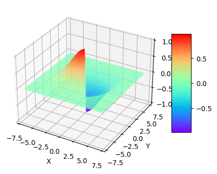

# TGD
This is the official code implementation of the paper [Tao General Differential and Difference: Theory and Application](http://arxiv.org/abs/2305.08098).

## Install 

pip install -i https://test.pypi.org/simple/ TGD==0.9.1

## USAGE

### One-dimentional
To see how different kernel functions shape  TGD kernels, please view [DifferentKernels1D.ipynb](https://github.com/THU-CVlab/TGD/blob/main/demos/kernels/DifferentKernels1D.ipynb).

To see how to get your one-dimentional TGD kernels for downstream applications,  please view [Kernels1D.ipynb](https://github.com/THU-CVlab/TGD/blob/main/demos/kernels/Kernels1D.ipynb)

### 2D
To see how to get your 2D TGD kernels for downstream applications,  please view [Kernels2D.ipynb](https://github.com/THU-CVlab/TGD/blob/main/demos/kernels/Kernels2D.ipynb)

